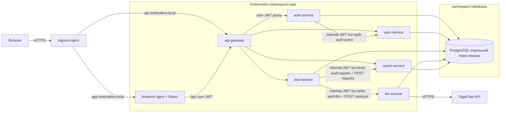
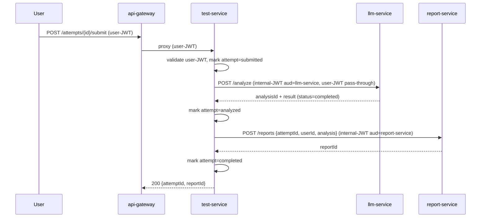

# Education Platform — MVP Implementation Plan

## 1. Цель и scope

Реализовать рабочий E2E happy-path: `register → login → list tests → take test → submit → LLM-анализ (GigaChat) → отчёт`. Каждый сервис продакшен-готов: stateless, env-конфиг, health/ready/metrics, graceful shutdown, JSON-логи, multi-replica, non-root в контейнере, NetworkPolicy.

## 2. Архитектура




Сценарий синхронный (HTTP), но все таблицы и API полей `status` уже содержат `pending|processing|completed|failed` — переезд на очередь в будущем не сломает контракты.

Submit-flow строго оркестрирует только `test-service`:




Принципиально: ни `llm-service`, ни `report-service` не дёргают другие сервисы — они получают всё нужное в payload от `test-service`. Это упрощает retry/recovery и убирает циклические зависимости.

## 3. Зафиксированные технические решения

- HTTP/Web framework: **FastAPI** (на ASGI Starlette), ASGI-сервер **uvicorn**
- Логи: **structlog**, JSON-renderer, поля `service`, `request_id`, `level`, `event`, `ts`
- Метрики: **prometheus-client** + **prometheus-fastapi-instrumentator** (HTTP RED + бизнес-метрики + DB-pool метрики)
- DB driver/ORM: **SQLAlchemy 2.0 async** + **asyncpg** (тонкие репозитории, явные модели)
- Миграции: **Alembic** (async env.py), отдельный per-service образ `<svc>-migrate`, запуск как Kubernetes Job с ArgoCD-аннотациями `argocd.argoproj.io/hook: PreSync` + `argocd.argoproj.io/sync-wave: "-10"` (см. §7)
- JWT (user): **PyJWT**, HS256, общий `JWT_SECRET` через Secret
- Internal JWT (service-to-service): **PyJWT**, HS256, отдельный `INTERNAL_JWT_SECRET`, claims `{iss, aud, exp}` TTL 5 мин, валидация по `aud == <service-name>` (см. §5)
- Хеширование паролей: **passlib[bcrypt]**
- Валидация и DTO: **pydantic v2** (встроено в FastAPI), настройки — **pydantic-settings**
- HTTP-клиент service-to-service: **httpx.AsyncClient** с timeout/retries (через `httpx-retries` или ручной retry)
- Тесты: **pytest** + **pytest-asyncio** + **httpx.AsyncClient**; для repo-слоя — чистая БД из docker-compose в integration-тестах
- Линт/формат: **ruff** (заменяет flake8+isort+black); тип-чек — **mypy** (опционально на CI)
- Менеджер зависимостей: **uv** (`uv sync`, `uv lock`); ОДИН корневой `pyproject.toml` с per-service extras (`auth`, `user`, `test`, `llm`, `report`, `gateway`); shared libs в `pkg/` импортируются всеми сервисами
- Структура импортов: shared — `pkg.logger`, `pkg.config`, …; сервисы — `services.auth_service.app.main`, `services.auth_service.app.routes`, …; имена пакетов с подчёркиванием (Python не любит дефисы), имена k8s-сервисов в Helm остаются с дефисами
- Базовый Docker-образ: builder `python:3.12-slim`, runtime `python:3.12-slim` + non-root user, multi-stage: builder ставит зависимости в `/opt/venv`, runtime копирует venv и код
- OpenAPI 3.0 — генерируется FastAPI автоматически на `GET /openapi.yaml` и `GET /docs` (Swagger UI), плюс ручные дополнения в схемах

## 4. Структура репозиториев

### 4.1. App-repo `education-platform/` (код + локальный dev)

```
education-platform/
├── pyproject.toml             # ОДИН корневой проект с extras: [project.optional-dependencies] auth/user/test/llm/report/gateway
├── uv.lock
├── ruff.toml
├── .python-version            # 3.12
├── services/
│   ├── auth_service/
│   ├── user_service/
│   ├── test_service/
│   ├── llm_service/
│   ├── report_service/
│   └── api_gateway/
├── pkg/                       # shared Python libs (config, logger, app_factory, errors, jwt_auth, internal_auth, metrics, db, health)
├── frontend/                  # React + Vite + TS + nginx prod-Dockerfile
├── docs/
│   ├── openapi/               # сервисы сами генерируют, тут хранятся снапшоты для CI
│   └── curl-examples.md
├── scripts/                   # dev-utils: psql.sh, gen-jwt.py, seed.py
├── docker-compose.yml
├── Jenkinsfile
└── README.md
```

Каждый Python-сервис:

```
services/<svc>_service/
├── app/
│   ├── __init__.py
│   ├── main.py                # создание FastAPI через pkg.app_factory.create_app(...)
│   ├── config.py              # pydantic-settings, наследуется от pkg.config.BaseSettings
│   ├── deps.py                # FastAPI dependencies: get_db, get_current_user, …
│   ├── routes/                # роутеры по доменам
│   ├── services/              # бизнес-логика
│   ├── repositories/          # запросы к БД через SQLAlchemy async
│   ├── models.py              # ORM-модели (SQLAlchemy 2.0 Mapped*)
│   ├── schemas.py             # pydantic v2 DTO
│   └── clients/               # HTTP-клиенты к другим сервисам / LLM
├── alembic/
│   ├── env.py                 # async Alembic + загружает models из app.models
│   ├── script.py.mako
│   └── versions/
├── alembic.ini
├── Dockerfile                 # multi-stage, ставит .[<svc>] extras
├── Dockerfile.migrate         # отдельный образ только с alembic + миграциями
└── tests/
    ├── conftest.py
    ├── test_routes_*.py
    └── test_services_*.py
```

Имя Python-пакета — с подчёркиванием (`auth_service`), имя Kubernetes Service / image — с дефисом (`auth-service`). Маппинг описан в `docs/naming.md` и используется во всех Dockerfile.

Импорт-пути:
- `from pkg.app_factory import create_app`
- `from services.auth_service.app.routes.auth import router`
- `from services.auth_service.app.models import User`

Запуск сервиса локально: `uv run uvicorn services.auth_service.app.main:app --host 0.0.0.0 --port 8080`.

### 4.2. Deploy-repo `education-platform-deploy/` (GitOps)

```
education-platform-deploy/
├── argocd/
│   ├── root-app.yaml                   # app-of-apps: Application, source=argocd/applications/
│   └── applications/
│       ├── postgresql.yaml             # отдельный ArgoCD Application → charts/postgresql, namespace=database, sync-wave=-20
│       └── education-platform.yaml     # отдельный ArgoCD Application → charts/education-platform, namespace=app, sync-wave=0
├── charts/
│   ├── postgresql/                     # ТОЛЬКО PostgreSQL (отдельный Helm release)
│   │   ├── Chart.yaml                  # dependencies: bitnami/postgresql 15.x
│   │   ├── values.yaml                 # storageClass=nfs-client, initdbScripts создающий 5 schemas + 5 roles
│   │   └── templates/
│   │       ├── secret.yaml             # postgres-root + 5 per-service secrets (auth-db, users-db, ...)
│   │       └── networkpolicy.yaml      # ingress только из ns=app, default-deny остальное
│   └── education-platform/             # ТОЛЬКО приложения (6 сервисов + frontend)
│       ├── Chart.yaml                  # БЕЗ зависимостей на postgresql
│       ├── values.yaml                 # дефолты
│       ├── values-prod.yaml
│       └── templates/
│           ├── _helpers.tpl
│           ├── namespace.yaml
│           ├── <svc>-deployment.yaml
│           ├── <svc>-service.yaml
│           ├── <svc>-configmap.yaml
│           ├── <svc>-secret.yaml
│           ├── <svc>-migrate-job.yaml  # ArgoCD PreSync hook + sync-wave=-10
│           ├── ingress.yaml
│           ├── networkpolicy.yaml      # включая явный egress DNS allow
│           └── serviceaccount.yaml
└── README.md
```

ArgoCD sync-wave порядок:

- `postgresql` Application — wave `-20` (применяется первым, отдельный release/namespace)
- migrate-Job'ы в `education-platform` — PreSync hook с sync-wave `-10`
- Deployments сервисов — sync-wave `0` (дефолт)

Jenkins после успешного build пушит коммит в deploy-repo, изменяя `services.<svc>.image.tag` в `charts/education-platform/values.yaml`. ArgoCD автоматически синкает. PostgreSQL чарт обновляется отдельно (вручную или из infra-пайплайна) и не зависит от релизов приложения.

## 5. Shared-библиотеки `pkg/` (DRY между сервисами)

- `pkg/config.py` — `BaseAppSettings(pydantic_settings.BaseSettings)` с общими полями (`APP_NAME`, `APP_ENV`, `APP_PORT`, `LOG_LEVEL`, `METRICS_ENABLED`). Сервисы наследуются и дополняют (DB, JWT, LLM).
- `pkg/logger.py` — конфигурация **structlog** + stdlib logging, JSON-renderer, processor добавляет `service`, `request_id` (из contextvar), `ts`. Функция `setup_logging(level, service_name)`.
- `pkg/app_factory.py` — `create_app(settings, *, on_startup, on_shutdown, ready_checks)`:
  - инициализирует FastAPI, ставит middleware (RequestID, structlog-context, CORSMiddleware при включении, prometheus instrumentator),
  - регистрирует `GET /healthz` `GET /readyz` `GET /metrics`,
  - регистрирует общий error-handler (см. `pkg/errors`),
  - возвращает `FastAPI` instance.
- `pkg/errors.py` — `class AppError(Exception)` с `code, message, details, status`. FastAPI exception_handler конвертирует в тело:
  ```json
  {"error":{"code":"VALIDATION_ERROR","message":"Invalid request body","details":{}},"request_id":"…"}
  ```
  Дополнительно перехватываются `RequestValidationError`, `HTTPException` и unhandled `Exception` (последний → 500 INTERNAL).
- `pkg/jwt_auth.py` — выпуск/валидация **user-JWT**:
  - `issue_token(sub, role, ttl)` → возвращает строку
  - FastAPI `Depends(get_current_user)` парсит `Authorization: Bearer <jwt>`, валидирует HS256 по `JWT_SECRET`, возвращает `CurrentUser(id, role)`
  - `require_roles("admin","manager")` — фабрика зависимостей для роутов
- `pkg/internal_auth.py` — service-to-service JWT:
  ```python
  class InternalIssuer:
      def __init__(self, self_name: str, secret: str, ttl_seconds: int = 300): ...
      def token(self, audience: str) -> str: ...

  def require_internal_caller(*allowed: str) -> Callable:  # FastAPI dependency
      ...
  def require_user_or_internal(*allowed: str) -> Callable:
      ...
  ```
  Middleware/dependency читает `X-Internal-Token`, валидирует подпись по `INTERNAL_JWT_SECRET` + `aud == settings.app_name` + `iss in allowed` + `exp` не истёк.
- `pkg/metrics.py` — общая регистрация: `http_requests_total`, `http_request_duration_seconds`, `http_errors_total`, `db_pool_*`, бизнес-метрики; экспорт через `prometheus-fastapi-instrumentator`.
- `pkg/db.py` — фабрика `create_engine_and_session(settings)` → `(AsyncEngine, async_sessionmaker)`; параметры пула из env: `DB_MAX_OPEN_CONNS` → `pool_size`, `DB_MAX_IDLE_CONNS` → `max_overflow`/`pool_pre_ping`, `DB_CONN_MAX_LIFETIME` → `pool_recycle`. Корутина `ping(engine)` для readiness.
- `pkg/health.py` — readiness-чеки: `check_db(engine)`, `check_http(url)`. Используются как параметр `ready_checks` в `create_app`.
- `pkg/http_client.py` — фабрика `make_internal_client(base_url, issuer, target)` возвращает `httpx.AsyncClient` с автоматическим добавлением `X-Internal-Token` через event-hook, timeout/retry.

## 6. Сервисы и API

Все сервисы слушают `0.0.0.0:8080`, отдают `/healthz`, `/readyz`, `/metrics`, `/openapi.yaml` и бизнес-API на `/api/v1/...`. Все backend-сервисы валидируют пробрасываемый user-JWT через `pkg/jwtauth`. Endpoints, вызываемые ТОЛЬКО другими сервисами, защищены `pkg/internalauth.RequireInternalCaller(...)`.

### 6.1. `auth-service` (schema `auth`)

Таблицы: `users(id uuid pk, email unique, password_hash, role enum(employee|manager|admin), created_at)`, `refresh_tokens(id, user_id fk, token_hash, expires_at, revoked_at)`.

Endpoints:

- `POST /api/v1/auth/register` → создать пользователя в `auth.users`, затем `POST user-service /api/v1/users/internal` с `X-Internal-Token` (iss=`auth-service`, aud=`user-service`) для создания профиля
- `POST /api/v1/auth/login` → access (15m) + refresh (7d)
- `POST /api/v1/auth/refresh`
- `GET /api/v1/auth/me`

### 6.2. `user-service` (schema `users`)

Таблицы: `profiles(user_id uuid pk, full_name, department, position, role, updated_at)`.

Endpoints (user-JWT): `GET /api/v1/users/me`, `GET /api/v1/users/{id}`, `GET /api/v1/users` (admin/manager), `PATCH /api/v1/users/{id}`.
Endpoint (internal-JWT, `RequireInternalCaller("auth-service")`): `POST /api/v1/users/internal` — bootstrap-создание профиля сразу после регистрации.

### 6.3. `test-service` (schema `tests`) — ЕДИНСТВЕННЫЙ orchestrator submit-flow

Таблицы: `tests`, `questions(test_id, order, type enum(single|multiple|free_text), text, weight)`, `options(question_id, text, is_correct)`, `attempts(id, test_id, user_id, status enum(started|submitted|analyzed|completed|failed), started_at, submitted_at, score, report_id nullable)`, `answers(attempt_id, question_id, selected_option_ids[], free_text)`.

Endpoints (user-JWT): `POST/GET /api/v1/tests`, `GET /api/v1/tests/{id}`, `POST /api/v1/tests/{id}/start`, `POST /api/v1/attempts/{id}/answers`, `POST /api/v1/attempts/{id}/submit`, `GET /api/v1/attempts/{id}`.

Поведение `submit` (синхронный orchestrator, см. sequence-диаграмму в §2):

1. Помечает `attempts.status = submitted`.
2. С `X-Internal-Token` (iss=`test-service`, aud=`llm-service`) шлёт `POST llm-service /api/v1/analyze` с payload `{attemptId, userId, test, questions, answers}`. Ждёт ответ `{analysisId, status=completed, result}`.
3. Помечает `attempts.status = analyzed`.
4. С `X-Internal-Token` (iss=`test-service`, aud=`report-service`) шлёт `POST report-service /api/v1/reports` с готовым `{attemptId, userId, analysis: {strengths, weaknesses, recommendations, score}}`. Получает `{reportId}`.
5. Помечает `attempts.status = completed`, сохраняет `report_id`.

Никакие другие сервисы во flow ни к кому не ходят. На любом шаге fail → `attempts.status = failed`, лог + метрика.

### 6.4. `llm-service` (schema `llm`)

Таблицы: `analyses(id, attempt_id, status, prompt, raw_response jsonb, recommendations jsonb, error, created_at, updated_at)`.

Адаптер `internal/llmclient`: интерфейс `Analyzer.Analyze(ctx, input) (Result, error)`, реализации:

- `gigachat` — OAuth2 client_credentials + POST `/api/v1/chat/completions`, env: `LLM_API_URL`, `LLM_API_KEY` (client_id:client_secret в Secret), `LLM_MODEL=GigaChat`, `LLM_TIMEOUT_SECONDS`
- `mock` — детерминированный для dev/тестов

Endpoints (защищены `RequireInternalCaller("test-service")`):

- `POST /api/v1/analyze` — payload содержит всё, что нужно для промпта; сервис НЕ ходит в test/user-service
- `GET /api/v1/analyze/{id}` — допускаем `RequireUserOrInternal("test-service")` для отладки/гейтвея

Промпт строится из `test+questions+answers`, ожидается JSON-ответ со схемой: `{strengths, weaknesses, recommendations:[{topic, resource_url, reason}], score}`. Парсинг strict.

### 6.5. `report-service` (schema `reports`)

Таблицы: `reports(id, attempt_id, user_id, analysis_id, status, json jsonb, html bytea, created_at)`, `recommendations(report_id, topic, resource_url, reason)`.

Endpoints:

- `POST /api/v1/reports` — `RequireInternalCaller("test-service")`. Payload содержит уже готовый `analysis`-блок; report-service НЕ ходит в llm/user-service.
- `GET /api/v1/reports/{id}` — user-JWT (роли employee/manager/admin)
- `GET /api/v1/reports/user/{userId}` — user-JWT (manager/admin)
- `GET /api/v1/reports/{id}/download?format=json|html` — user-JWT

PDF — out of scope MVP, HTML-рендер через `html/template`, формат заявлен в OpenAPI.

### 6.6. `api-gateway` (без БД)

- FastAPI + **httpx.AsyncClient** для проксирования; единый catch-all роут `/{full_path:path}` маршрутизирует префиксы:
  - `/api/v1/auth/*` → `AUTH_SERVICE_URL`
  - `/api/v1/users/*` → `USER_SERVICE_URL`
  - `/api/v1/tests/*`, `/api/v1/attempts/*` → `TEST_SERVICE_URL`
  - `/api/v1/reports/*` → `REPORT_SERVICE_URL`
- Адреса из env: `AUTH_SERVICE_URL`, `USER_SERVICE_URL`, `TEST_SERVICE_URL`, `LLM_SERVICE_URL`, `REPORT_SERVICE_URL`
- Middleware: request-id, structlog-context, prometheus, CORS, error-handler, JWT validation для всего кроме `/api/v1/auth/login|register|refresh` и `/healthz|/readyz|/metrics`
- Пробрасывает оригинальный `Authorization` header дальше; `X-Request-Id` сохраняется или генерируется новый
- `/api/v1/analyze/*` (llm-service) намеренно НЕ маршрутизируется наружу — llm-service защищён `internal-JWT` и доступен только из test-service

## 7. PostgreSQL и миграции

**Развёртывание PostgreSQL — ОТДЕЛЬНЫЙ Helm release / ArgoCD Application** (не subchart):

- `charts/postgresql/` — chart с `dependencies: bitnami/postgresql:15.x`, релиз `education-postgresql` в namespace `database`
- ArgoCD Application `postgresql.yaml` с `argocd.argoproj.io/sync-wave: "-20"` — применяется до приложения; имеет независимый lifecycle (можно обновлять/делать backup-restore без переразвёртывания сервисов)
- DNS внутри кластера: `education-postgresql.database.svc.cluster.local:5432`
- Storage: PVC через `nfs-client` StorageClass
- `NetworkPolicy` в namespace `database`: ingress 5432 только из namespace `app`, default-deny остального

**Изоляция данных — ЗАФИКСИРОВАНО: schema-per-service**

- Одна БД `education`
- Пять схем (по сервису): `auth`, `users`, `tests`, `llm`, `reports`
- Пять ролей: `auth_user`, `users_user`, `tests_user`, `llm_user`, `reports_user`
- Каждая роль `OWNS` свою схему; `REVOKE ALL ON SCHEMA <other> FROM <role>` — кросс-сервисный доступ к таблицам соседа на уровне БД невозможен
- Bootstrap (создание схем, ролей, GRANT'ов) — через `initdbScripts` в `values.yaml` чарта `postgresql` (запускается один раз при первой инициализации БД)
- Per-service Secret'ы с паролями (`auth-db`, `users-db`, `tests-db`, `llm-db`, `reports-db`) создаются template'ами `charts/postgresql/templates/secret.yaml` и читаются сервисами в `charts/education-platform/` через `existingSecret` ссылку

**Миграции — Kubernetes Job + ArgoCD PreSync + sync-wave** (не Helm hooks):

- Образ `<svc>-migrate` = `migrate/migrate` + COPY `services/<svc>/migrations/`
- Шаблон `<svc>-migrate-job.yaml` имеет аннотации:
  ```yaml
  metadata:
    annotations:
      argocd.argoproj.io/hook: PreSync
      argocd.argoproj.io/hook-delete-policy: BeforeHookCreation
      argocd.argoproj.io/sync-wave: "-10"
  ```
- ArgoCD выполняет PreSync hooks ПОСЛЕ применения Postgres (wave `-20`) и ДО Deployments (wave `0`)
- Job использует `existingSecret` с DSN своего сервиса, команда: `migrate -path=/migrations -database=$DB_DSN up`
- `Connection-pool` в коде через env: `DB_MAX_OPEN_CONNS`, `DB_MAX_IDLE_CONNS`, `DB_CONN_MAX_LIFETIME`

## 8. Helm chart `charts/education-platform` (приложения, БЕЗ Postgres)

Структура `values.yaml` (Postgres зависимостей здесь нет — он в отдельном чарте):

```yaml
global:
  imageRegistry: harbor.mokryakov.local/education-platform
  imageTag: ""               # перекрывается per-service из CI
  postgres:
    host: education-postgresql.database.svc.cluster.local
    port: 5432
    database: education
  secrets:
    jwtSecretName: jwt-secret              # содержит JWT_SECRET (user)
    internalJwtSecretName: internal-jwt    # содержит INTERNAL_JWT_SECRET

services:
  auth-service:
    enabled: true
    replicaCount: 2
    image: { repository: auth-service, tag: "" }
    resources: { requests: {cpu: 50m, memory: 64Mi}, limits: {cpu: 500m, memory: 256Mi} }
    env: { APP_PORT: "8080", LOG_LEVEL: info }
    db: { schema: auth, existingSecret: auth-db }
    migrate: { enabled: true, image: { repository: auth-service-migrate, tag: "" } }
    internalAllowedCallers: []             # auth не принимает internal вызовов от других
  user-service:
    db: { schema: users, existingSecret: users-db }
    internalAllowedCallers: ["auth-service"]
  test-service:
    db: { schema: tests, existingSecret: tests-db }
    internalAllowedCallers: []
  llm-service:
    db: { schema: llm, existingSecret: llm-db }
    internalAllowedCallers: ["test-service"]
    secrets:
      gigachat:                            # отдельный Secret
        existingSecret: gigachat-creds     # содержит client_id, client_secret
  report-service:
    db: { schema: reports, existingSecret: reports-db }
    internalAllowedCallers: ["test-service"]
  api-gateway:
    db: { enabled: false }                 # gateway не использует БД
    env:
      AUTH_SERVICE_URL: http://auth-service:8080
      USER_SERVICE_URL: http://user-service:8080
      TEST_SERVICE_URL: http://test-service:8080
      LLM_SERVICE_URL: http://llm-service:8080
      REPORT_SERVICE_URL: http://report-service:8080

frontend:
  enabled: true
  replicaCount: 2
  image: { repository: frontend, tag: "" }
  apiUrl: https://api.mokryakov.local

ingress:
  enabled: true
  className: nginx
  hosts:
    - host: app.mokryakov.local
      service: frontend
    - host: api.mokryakov.local
      service: api-gateway

networkPolicies:
  enabled: true                            # default-deny + явные allow (см. ниже)
  dns:
    enabled: true                          # ВАЖНО: явный egress allow к DNS
    coreDnsNamespace: kube-system
    coreDnsSelector: { k8s-app: kube-dns }
    nodeLocalDnsIP: "169.254.20.10"        # NodeLocalDNS link-local, /32
```

Шаблоны (`charts/education-platform/templates/`):

- Общий `_deployment.tpl` рендерится для каждого `services.<name>.enabled=true` в `range $name, $svc := .Values.services`
- `securityContext`: `runAsNonRoot: true`, `runAsUser: 65532`, `readOnlyRootFilesystem: true`, `allowPrivilegeEscalation: false`, `capabilities.drop: ["ALL"]`, `seccompProfile.type: RuntimeDefault`
- Probes: `livenessProbe` → `/healthz`, `readinessProbe` → `/readyz` (initialDelaySeconds 5, periodSeconds 5)
- `<svc>-migrate-job.yaml` — с ArgoCD-аннотациями `PreSync` + `sync-wave=-10`, без Helm hooks
- `<svc>-secret.yaml` для llm-service ссылается на `gigachat-creds` через `secretKeyRef`
- Все сервисы получают env `JWT_SECRET` и `INTERNAL_JWT_SECRET` из общих Secret'ов через `valueFrom.secretKeyRef`

**NetworkPolicy** (`templates/networkpolicy.yaml`):

- `default-deny` (ingress + egress) на namespace `app`
- Per-service ingress allow: `frontend` ← ingress-nginx; `api-gateway` ← ingress-nginx; `auth/user/test/report-service` ← `api-gateway`; `user-service` ← `auth-service` (internal endpoint); `llm-service` ← `test-service`; `report-service` ← `test-service`
- Per-service egress allow: все backend → Postgres (`namespaceSelector: kubernetes.io/metadata.name=database`, port 5432); `api-gateway` → 5 upstream сервисов; `test-service` → llm + report; `llm-service` → внешний GigaChat (egress на 443 без podSelector, опционально по CIDR)
- **DNS egress (ВАЖНО, иначе всё ломается)** — отдельный шаблонный блок, добавляется в `egress` КАЖДОГО pod-policy:
  ```yaml
  - to:
      - namespaceSelector: { matchLabels: { kubernetes.io/metadata.name: kube-system } }
        podSelector: { matchLabels: { k8s-app: kube-dns } }
    ports:
      - { protocol: UDP, port: 53 }
      - { protocol: TCP, port: 53 }
  - to:
      - ipBlock: { cidr: 169.254.20.10/32 }      # NodeLocalDNS
    ports:
      - { protocol: UDP, port: 53 }
      - { protocol: TCP, port: 53 }
  ```
- ArgoCD Application управляется через `argocd/applications/education-platform.yaml` с `syncPolicy.automated.prune=true, selfHeal=true`

## 9. Jenkinsfile (declarative pipeline)

Стейджи:

1. `Checkout` — git clone app-repo
2. `Setup` — `pip install uv && uv sync --all-extras` (кешируется на agent'е)
3. `Lint` — один прогон: `uv run ruff check .` + `uv run ruff format --check .` + `npm --prefix frontend run lint`
4. `Test` — один прогон: `uv run pytest -q --maxfail=1` + `npm --prefix frontend test --if-present`
5. `Build images` (matrix по 6 сервисам + frontend, параллельно) — `docker buildx build --build-arg SERVICE=<svc>_service -t harbor.mokryakov.local/education-platform/<svc>-service:<sha>` (общий Dockerfile принимает аргумент, ставит extras `.[<svc>]`); tag = `${GIT_COMMIT[0..7]}`
6. `Build migrate images` (matrix по 5 backend) — `harbor.mokryakov.local/education-platform/<svc>-service-migrate:<sha>`
7. `Update deploy-repo` — клон deploy-repo, `yq -i '.services.<svc>-service.image.tag = "<sha>"' charts/education-platform/values.yaml` и `.services.<svc>-service.migrate.image.tag = "<sha>"`, `git commit && git push`
8. ArgoCD автоматически синкает Application `education-platform` (PostgreSQL release не трогается)

Credentials в Jenkins: `harbor-creds`, `deploy-repo-ssh`, `kubeconfig` (для опциональной верификации). Опционально: `helm lint charts/education-platform` и `helm template ... | kubectl apply --dry-run=server` на стейдже `Validate`.

## 10. Frontend `frontend/`

- Vite + React + TypeScript
- Роуты: `/login`, `/register`, `/tests`, `/tests/:id/take`, `/attempts/:id/result`, `/admin/tests` (только manager/admin)
- `axios` instance с baseURL `${VITE_API_URL}` (env подставляется в Docker build), interceptor добавляет `Authorization`
- Prod-Dockerfile: stage1 `node:22-alpine` собирает `dist/`, stage2 `nginxinc/nginx-unprivileged:alpine` отдаёт + конфиг с SPA fallback
- В Helm — Deployment + Service + Ingress на `app.mokryakov.local`

## 11. Локальный dev и документация

- `docker-compose.yml`: postgres-15 + все 6 сервисов + frontend + 5 migrate-контейнеров (профиль `migrate`); миграции запускаются `docker compose --profile migrate up`
- Без Docker, голый Python: `uv sync --all-extras` затем `uv run uvicorn services.<svc>_service.app.main:app --reload --port <PORT>` (порты разные per-svc для локального запуска параллельно)
- `scripts/`:
  - `gen_jwt.py` — генератор JWT для curl-примеров
  - `seed.py` — заливает тестовые данные через прямой SQL
  - `psql.sh` — `docker compose exec postgres psql -U …`
- `README.md`: запуск локально (compose / uv), сборка образов, деплой через Helm, env-variables таблица, как применять миграции, troubleshooting, curl-примеры (см. `docs/curl-examples.md`)
- FastAPI отдаёт `/docs` (Swagger UI), `/redoc`, `/openapi.json`, `/openapi.yaml` каждым сервисом

## 12. Тесты (минимально достаточные)

- Per-service unit-тесты для `services/` слоя (бизнес-логика, mock-репозитории через pytest fixtures)
- Route-тесты через `httpx.AsyncClient(transport=httpx.ASGITransport(app=app))` для основных endpoint'ов с моками внешних зависимостей
- Один integration smoke-тест на сервис: запускает реальный `AsyncEngine` против БД из compose, прогоняет alembic upgrade head, делает базовый CRUD
- В Jenkins `Test` стейдже unit/route-тесты обязательны, integration — опционально (флагом `RUN_INTEGRATION=1`)

## 13. Критерии готовности (mapping на спеку)

Все 14 пунктов спеки покрываются:

- stateless контейнеры + env-конфиг + `/healthz` `/readyz` `/metrics` + graceful shutdown через `pkg/httpx`
- JSON-логи через `pkg/logger`
- Миграции через Kubernetes Job с `argocd.argoproj.io/hook: PreSync` + `sync-wave: -10`
- Helm-chart `charts/education-platform` деплоит всё в namespace `app`; PostgreSQL — отдельный release в namespace `database`
- Hardcoded IP отсутствуют; DNS-имена и адреса соседних сервисов берутся из env
- Multi-replica через `replicaCount` (stateless, JWT-based auth — никаких sticky-sessions не нужно)
- Внешний доступ только через Ingress на `frontend` и `api-gateway`; внутренние сервисы изолированы default-deny + явные allow в NetworkPolicy; DNS egress allow явно прописан
- Service-to-service вызовы защищены internal-JWT + NetworkPolicy (defense-in-depth)
- Submit-flow строго оркестрирует только `test-service`; `llm-service` и `report-service` не имеют исходящих вызовов к другим сервисам

